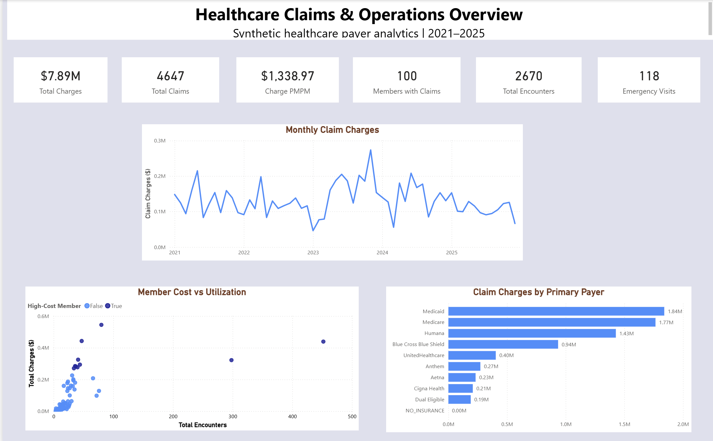
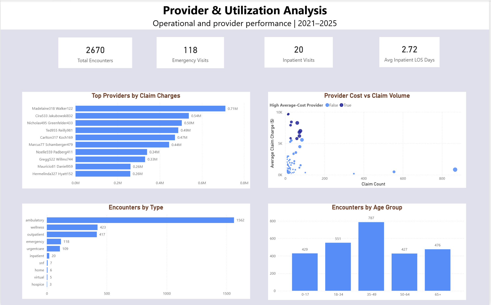
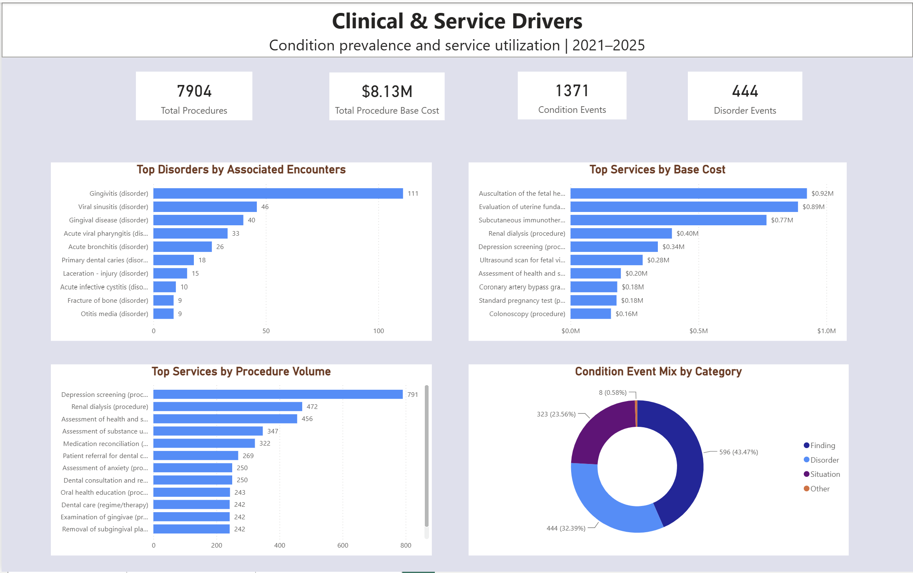

# Healthcare Claims & Operations Analytics

An end-to-end healthcare analytics project built with PostgreSQL, SQL, Power BI, Power Query, and DAX using synthetic Synthea healthcare data.

The project transforms raw healthcare data into a structured analytics model and an interactive three-page Power BI dashboard focused on claims cost, member utilization, provider performance, payer trends, conditions, and healthcare services.

## Project Overview

This project simulates a healthcare payer and operations analytics workflow. Raw synthetic healthcare data was loaded into PostgreSQL, cleaned and transformed through staging tables, modeled into an analytics-ready star schema, and summarized through reusable business views.

The final Power BI report analyzes the 2021–2025 reporting period across three areas:

- Executive claims and cost performance
- Provider and utilization analysis
- Clinical conditions and service drivers

## Tools & Technologies

- PostgreSQL
- SQL
- Power BI
- Power Query
- DAX
- Data modeling
- Git & GitHub
- Synthea synthetic healthcare data

## Data Pipeline

`Synthea CSV Data → PostgreSQL Raw Layer → Staging Layer → Analytics Star Schema → Business Views → Power BI Dashboard`
## Power BI Dashboard

### 1. Executive Overview


### 2. Provider & Utilization Analysis


### 3. Clinical & Service Drivers


## Key Business Insights & Recommendations

### 1. A small group of members accounts for a large share of costs
The top 10% of members were responsible for about 44% of total claim charges. This shows that healthcare spending in the dataset is concentrated among a relatively small number of members.

**Recommendation:** Look more closely at high-cost and high-utilization members to understand whether repeated visits, specific services, or certain conditions are driving their costs.

### 2. Monthly claim costs vary quite a bit
Claim charges changed noticeably from month to month between 2021 and 2025, with some months showing clear cost spikes.

**Recommendation:** Review the highest-cost months in more detail and break them down by member, provider, payer, and service type to understand what caused the increase.

### 3. A few payers account for most claim charges
Medicaid and Medicare had the highest primary-payer claim charges, followed by Humana and Blue Cross Blue Shield.

**Recommendation:** Compare payer-level membership, utilization, PMPM, and service use to see whether higher costs are mainly related to having more members or higher utilization per member.

### 4. High provider volume does not always mean high average cost
Some providers had high average claim costs even with lower claim volumes, while some high-volume providers had relatively lower average costs.

**Recommendation:** Provider performance should be reviewed using both cost and volume instead of relying on one metric alone. Higher costs should also be considered alongside utilization patterns and case mix.

### 5. Most encounters were ambulatory
Out of 2,670 encounters, 1,562 were ambulatory visits. Emergency visits totaled 118, while inpatient visits were much less common at 20.

**Recommendation:** Since most utilization occurs in ambulatory settings, this area would be important for operational planning. Emergency and inpatient use should still be monitored for unusual or high-utilization patterns.

### 6. The most common procedures are not always the most expensive
Depression screening had the highest procedure volume, but other services such as fetal auscultation, uterine fundal evaluation, and subcutaneous immunotherapy contributed more to total procedure base cost.

**Recommendation:** Procedure performance should be viewed from both a volume and cost perspective because the most frequently used services are not always the biggest cost drivers.

### 7. The 35–49 age group had the highest encounter volume
The 35–49 age group had 787 encounters, which was the highest among the age groups in the analysis.

**Recommendation:** Looking at the conditions and procedures used by this age group could help explain what is driving their higher utilization.

## Methodology

The project follows a layered analytics workflow:

1. Raw Synthea healthcare CSV files were loaded into PostgreSQL.
2. A staging layer was created to clean data types, standardize fields, and validate keys and relationships.
3. An analytics star schema was built using member, date, provider, organization, and payer dimensions with claims, encounters, procedures, and conditions as fact tables.
4. Business-focused SQL views were created for cost, utilization, provider, payer, member, condition, and procedure analysis.
5. Power BI was connected to the PostgreSQL analytics layer using Import mode.
6. DAX measures and interactive visuals were used to build a three-page dashboard covering the 2021–2025 reporting period.

## Limitations

- The project uses synthetic Synthea healthcare data, so the findings should not be interpreted as real population-level healthcare trends.
- Procedure base cost represents the source procedure cost field and should not be interpreted as actual claim reimbursement.
- Conditions were not assigned claim costs because multiple conditions can be associated with the same encounter, which could lead to double counting.
- Payer analysis is based on the primary payer assigned to each claim.
- Provider cost differences are descriptive and should not be interpreted as indicators of fraud or quality without additional clinical and case-mix information.
- The readmission metric developed in SQL is a simple operational 30-day proxy and is not a CMS readmission measure.

## Repository Structure

```text
healthcare-claims-operations-analytics/
│
├── sql/
│   └── healthcare_claims_analytics.sql
│
├── powerbi/
│   └── Healthcare_Claims_Operations_Analytics.pbix
│
├── screenshots/
│   ├── executive-overview.png
│   ├── provider-utilization.png
│   └── clinical-service-drivers.png
│
└── README.md
